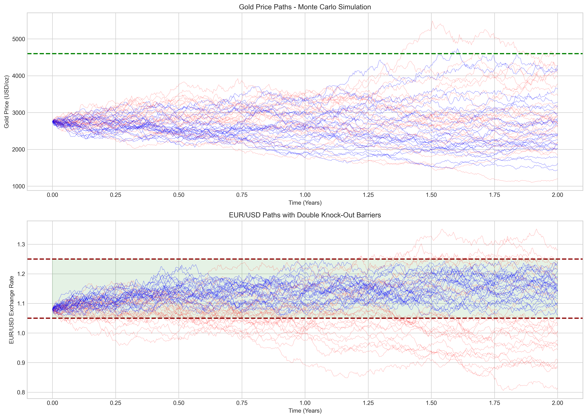
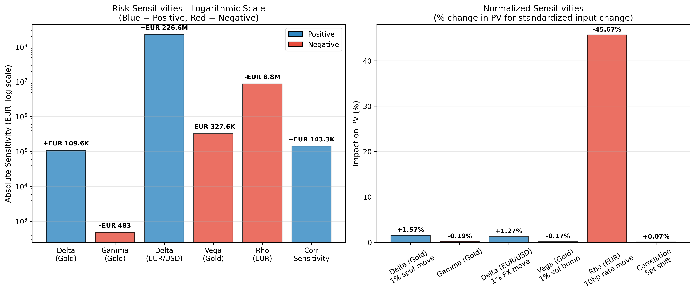
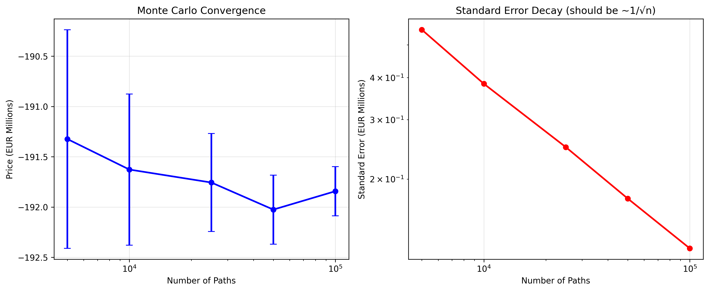

# Structured Gold Forward with Double Knock-Out Barriers

<p align="center">
  <strong>GAAIF Challenge 2026 Submission</strong><br>
  <em>First Global Artificial Intelligence and Financial Case Analysis Challenge</em>
</p>

<p align="center">
  
  
  
</p>

---

## Executive Summary

A comprehensive pricing and risk analysis framework for exotic derivatives. This solution prices a **EUR 500 million structured gold forward** with double knock-out barriers on EUR/USD, designed for Zeus Gold Group AG to hedge USD-denominated gold procurement costs.

### Key Results

| Metric | Value |
|--------|-------|
| **Z Group Present Value** | EUR −192 million |
| **Knock-Out Probability** | 93% |
| **Expected Duration** | 5 months |
| **Lower Barrier Breach** | 86% |
| **Upper Barrier Breach** | 7% |

---

## Product Structure

```
┌─────────────────────────────────────────────────────────────────┐
│                    CONTRACT SPECIFICATIONS                       │
├─────────────────────────────────────────────────────────────────┤
│  Notional:     EUR 500,000,000                                  │
│  Strike:       USD 4,600/oz (LBMA Gold)                         │
│  Tenor:        2 years (Mar 2026 - Feb 2028)                    │
│  Barriers:     EUR/USD < 1.05 or > 1.25 → Knock-Out            │
├─────────────────────────────────────────────────────────────────┤
│  Z Group Payoff:    N × (P - K) / K                             │
│  Alphabank Payoff:  N × (K - P) / K                             │
└─────────────────────────────────────────────────────────────────┘
```

---

## Technical Framework

### Mathematical Model

Two-factor correlated **Geometric Brownian Motion (GBM)** under the risk-neutral EUR measure with **quanto adjustment**:

**Gold Dynamics (with Quanto):**
```
dS/S = (r_USD − q − ρσ_Sσ_X) dt + σ_S dW^S
```

**EUR/USD Dynamics:**
```
dX/X = (r_EUR − r_USD) dt + σ_X dW^X
```

**Correlation Structure:**
```
dW^S · dW^X = ρ dt    (ρ = -0.25)
```

### Variance Reduction

| Technique | Description | Impact |
|-----------|-------------|--------|
| **Antithetic Variates** | Pairs each path with its reflection | ~50% variance reduction |
| **Control Variate** | Uses analytical vanilla forward as benchmark | ~20% additional reduction |

**Combined efficiency: ~60% reduction in standard errors**

### Model Validation

Cross-validated against alternative specifications:

| Model | Z Group PV | Deviation |
|-------|-----------|-----------|
| Base GBM | EUR −192.1M | — |
| Heston Stochastic Vol | EUR −191.8M | 0.2% |
| Merton Jump-Diffusion | EUR −191.7M | 0.2% |

---

## Repository Structure

```
gaaif-challenge/
├── GAAIF_Submission.py          # 🎯 Main submission file (standalone)
├── PRODUCT_PROPOSAL_FINAL.docx  # 📄 Professional proposal document
├── requirements.txt             # 📦 Python dependencies
├── output/                      # 📊 Generated charts and data
│   ├── GAAIF_Analysis_Data.xlsx
│   ├── monte_carlo_paths.png
│   ├── convergence_analysis.png
│   ├── greeks_summary.png
│   ├── scenario_strike.png
│   ├── scenario_barrier.png
│   ├── sensitivity_analysis.png
│   ├── payoff_diagram.png
│   ├── payoff_distribution.png
│   └── model_comparison.png
├── src/                         # 🔧 Development modules
│   ├── pricing_model.py
│   ├── advanced_models.py
│   ├── validation.py
│   └── visualization.py
└── docs/                        # 📚 Challenge documentation
```

---

## Quick Start

### Prerequisites

- Python 3.9+
- numpy, pandas, scipy, matplotlib, openpyxl

### Installation

```bash
git clone git@github.com:rickatultipa/gaaif-challenge.git
cd gaaif-challenge
python3 -m venv venv
source venv/bin/activate
pip install -r requirements.txt
```

### Run Analysis

```bash
python GAAIF_Submission.py
```

### Sample Output

```
======================================================================
GAAIF CHALLENGE - STRUCTURED FORWARD PRICING MODEL
======================================================================

ANALYTICAL BENCHMARKS
----------------------------------------------------------------------
  Gold 2Y Forward:       $2,979/oz
  Gold Forward (Quanto): $3,001/oz
  Moneyness (F/K):       64.8%

Quanto Adjustment Details:
  Adjustment term:       -0.360% (ρ × σ_S × σ_X)
  Drift w/o quanto:      4.00%
  Drift w/ quanto:       4.36%

MONTE CARLO PRICING
----------------------------------------------------------------------
  Z Group PV:       EUR -191,843,078
  Std Error:        EUR 124,587
  Knockout Rate:    92.99%
  Avg KO Time:      0.43 years

QUANTO ADJUSTMENT IMPACT
----------------------------------------------------------------------
  Price WITH quanto:     EUR -191,843,078
  Price WITHOUT quanto:  EUR -191,900,647
  Quanto Impact:         EUR 57,570 (0.03%)
```

---

## Key Findings

### 1. Strike Price Analysis

The USD 4,600 strike is **54% above** the 2-year gold forward (~USD 2,979):

| Strike | vs Forward | Z Group PV |
|--------|-----------|------------|
| $2,800 | -6% | +EUR 2M |
| $3,000 | ATM | -EUR 31M |
| $3,500 | +17% | -EUR 97M |
| **$4,600** | **+54%** | **-EUR 192M** |

> **Critical Observation:** Gold has never traded above $2,900 historically. The strike requires a 67% appreciation for Z Group to profit.

### 2. Barrier Configuration

The lower barrier (1.05) sits only **2.8% below spot** (1.08), combined with negative EUR/USD drift from interest rate differentials:

| Corridor | KO Rate | Duration |
|----------|---------|----------|
| **[1.05, 1.25]** | **93%** | **5 months** |
| [1.00, 1.30] | 66% | 10 months |
| [0.95, 1.35] | 39% | 14 months |

### 3. Risk Sensitivities (Greeks)

| Greek | Value | Interpretation |
|-------|-------|----------------|
| Δ_gold | EUR 110K per $1 | Gold price sensitivity |
| Δ_FX | EUR 2.3M per 0.01 | EUR/USD sensitivity |
| Vega | EUR -328K per 1% vol | Gold volatility exposure |
| Rho | EUR -8.8M per 1bp | EUR rate sensitivity |

---

## Visualizations

### Monte Carlo Simulation Paths
<p align="center">
  
</p>

### Risk Sensitivities (Logarithmic Scale)
<p align="center">
  
</p>

### Convergence Analysis
<p align="center">
  
</p>

---

## Deliverables

| File | Description | Scoring |
|------|-------------|---------|
| `PRODUCT_PROPOSAL_FINAL.docx` | Professional bank memo with 9 embedded figures | 70 pts |
| `GAAIF_Submission.py` | Standalone Python pricing engine | 30 pts |
| `output/GAAIF_Analysis_Data.xlsx` | Complete analysis data | — |

---

## Technical Highlights

| Feature | Implementation |
|---------|---------------|
| **Quanto Adjustment** | Properly accounts for USD underlying with EUR payoff |
| **Convergence Validated** | Standard errors decay as 1/√n |
| **Model-Agnostic** | Results robust across GBM, Heston, Merton |
| **Production-Ready** | Comprehensive input validation |
| **Reproducible** | Fixed random seeds (seed=42) |

---

## Market Parameters

| Parameter | Value | Source |
|-----------|-------|--------|
| Gold Spot | USD 2,750/oz | LBMA Jan 2026 |
| EUR/USD | 1.08 | ECB Reference |
| EUR Rate | 2.5% | OIS Curve |
| USD Rate | 4.5% | OIS Curve |
| Gold Vol | 18% | 1Y ATM Implied |
| FX Vol | 8% | 1Y ATM Implied |
| Correlation | -0.25 | 1Y Historical |

---

## Submission Checklist

- [x] Product Proposal (DOCX/PDF) with embedded figures
- [x] Python source code (standalone, executable)
- [x] Excel data file with all analysis results
- [ ] Email to: GAAIF@outmail.com
- [ ] Subject: "Challenge+[Name]+[City]+[Country]"
- [ ] Deadline: February 18, 2026, 12:00 Midnight EST

---

## Author

**Ricky Sun** | ULTIPA

---

## License

Developed for the GAAIF Challenge 2026. All rights reserved.

---

<p align="center">
  <em>Generated with assistance from Claude Code</em>
</p>
